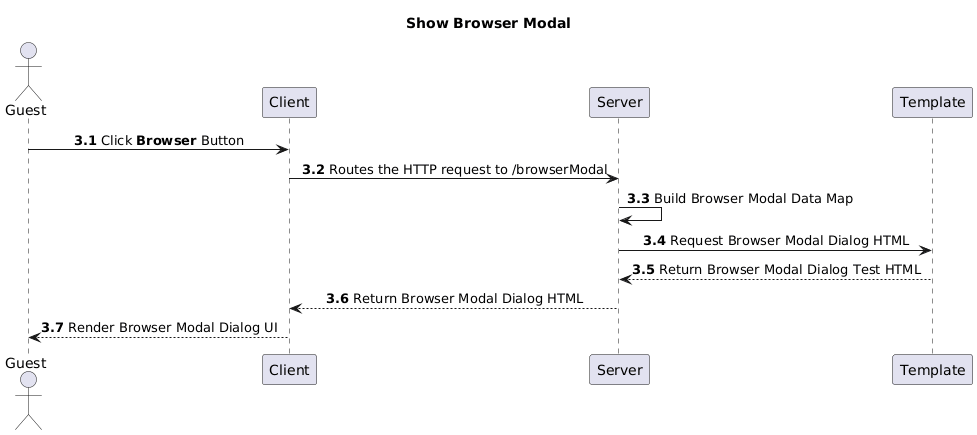
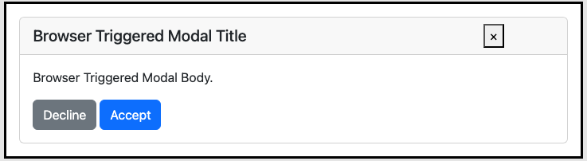
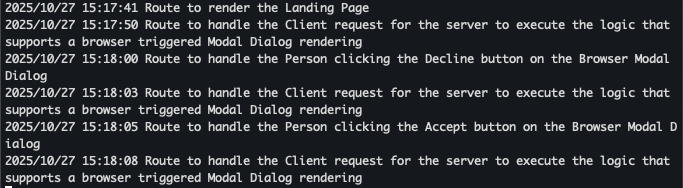
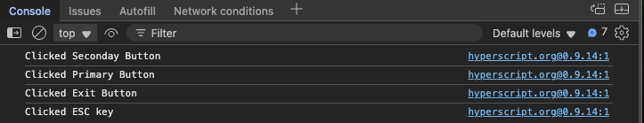
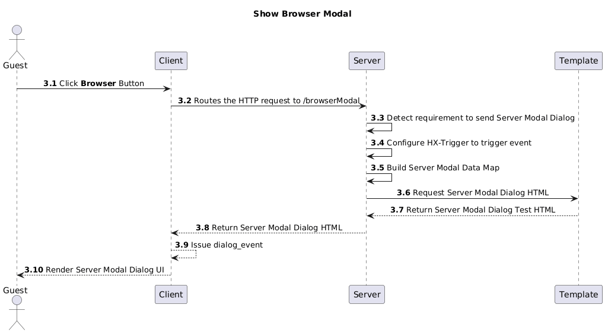
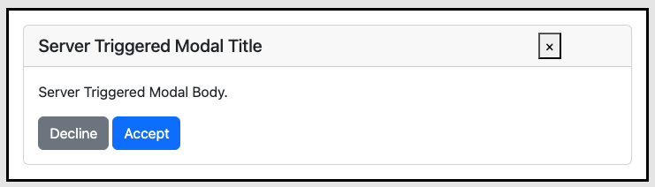

# Abstract and Acknowlegemens
I decided to build a mobile-first SaaS enterprise resourse planning application. The mobile-first requirement imposed two constraints. One, I'm not inclined to build at least two native applications, or spend money with frameworks that support it. Second, a webapp running on a phone must be stingy with resource utilization to prevent performance degradation.

This lead me to architect a solution with a minimal Browser footprint, using [Go](https://go.dev/) as the server engine and [Fiber](https://gofiber.io/) as the HTTP server. This led me to leveraging [Go HTML Templates](https://pkg.go.dev/html/template) in conjunction with the [Fiber Template Engine](https://docs.gofiber.io/template/html_v2.x.x/html/) to collaborate with [HTMX](https://htmx.org/) and [HyperScript](https://hyperscript.org/) to manipulate the DOM Tree on the Client.

Shortly into my work, I was challenged how to implement `Modal Dialogs` issued by the server, as for instance, to inform the guest they do not have the authortizarion to access a resource. The excellent article [Two ways to build HTML dialogs using HTMX and HyperScript](https://medium.com/@martin.mohnhaupt/two-ways-to-build-html-dialogs-using-htmx-and-hyperscript-5f5eefb13c4c) by [Martin Mohnhaupt](https://medium.com/@martin.mohnhaupt) has been instrumental to aid me in thinking about and implementing `Modal Dialogs` in my webapp. 

This repository introduces two different methods to display `Modal Dialogs`, `Browser Modal Dialog` and `Server Modal Dialog`. A _Modal Dialog_ is a pop-up window that appears on top of the current browser page, requiring user interaction before the user can return to the main content. It is commonly used to request confirmation to proceed with a destructive opperation, notify the user of a relevant application state, or collect required information from the user. We use _Browser Modal Dialogs_ to prompt the user to confirm an action, such as deleting a record, and _Server Modal Dialogs_ to either inform the user about the result of an operation, like lack of authorization for access a resource-- or to collected addition data, like a phone number.

I will demonstrate Martin's approach, refactored to suit my requirements, using a simple web application with a technology stack consisting of  [Go](https://go.dev/), [Fiber](https://gofiber.io/),  and the [Fiber Template Engine](https://docs.gofiber.io/template/html_v2.x.x/html/) on the Server, and [Bootstrap 5](https://getbootstrap.com/) , [HTMX](https://htmx.org/) and [HyperScript](https://hyperscript.org/) to manipulate the DOM Tree on the Client. This technology stack requires the Server to serve HTML, whereas other stacks use JSON requiring more complex technology stack on the Client; it also provides the software engineer with strategist to define precise places in the `DOM Tree`, as well as to decorate some of the DOM Tree elements with event handling instructions. 
Note that:
- I'll use the term `Server`, to refer to the `Go/Fiber` HTTP server;
- I'll use the term `Template`,to refer to the `GoFiber Template` engine;
- I'll use the term `Client`, to refer to the [HTMX](https://htmx.org/) and [HyperScript](https://hyperscript.org/) logic to handle the Templates returned by the _Server_ and hostedf by any **modern** browser;
- I'll use the term `webapp`, to refer to the web application consisting of the _Client_ and _Server_ mentioned above;

You can find the full implemention at [this repo](https://github.com/RodrigoMattosoSilveira/html_htmx-modal_dialogs) on [my github account](https://github.com/RodrigoMattosoSilveira).

# A Word About the Webapp Demo
Web applications using complex Client technology stacks, such as [React](https://react.dev/) and its vast constellation of addons, can handle the logic to triger, display, and manage _Modal Dialogs_  with minimal Server interaction. 

This _webapp_ uses a significantly simpler Client technology stack, [HTMX](https://htmx.org/) and [HyperScript](https://hyperscript.org/) to manipulate the DOM Tree, with a limited use of Javascript. Instead of relying on JSON payload and complex logic to express the User Experience, it relys on fully rendered HTL 

The _Landing Page_ includes 3 buttons,  `Prompt`, `Inform`, and `Collect`. Note that all 3 include logic requiring the _Client_ to request the Server to provide their _HTML_, and that this logic is decoupled of the _Modal Dialogs_ in of themselves. 

The _Prompt_ buttton triggers a _Modal Dialog_ requiring a guest action to confirm an operation, or dismiss the dialog; this is a _Browser_ _Modal Dialog_. The _Inform_ buttton triggers a _Modal Dialog_ informing the guest about a Server state, without requiring any addition action other than dismiss the dialog; this is a _Server_ _Modal Dialog_. The _Collect_ buttton triggers a _Modal Dialog_ asking the guest to provide a data element, or dismiss the dialog; this is a more complex _Server_ _Modal Dialog_.

# Use Cases
A use case is a detailed description of how a user interacts with a system to achieve a specific goal. Although ours are relatively simple, I included them here since I wrote and used them to implement the webapp, and thought they would help me explaning the webapp. Following are the use cases for our webapp, including the logic I used to implemenet them:
## Launch Webapp
1. **Setup Server**: I, as a guest, when I launch the _Server_, I want to see the _Fiber_ log incating that its ready to handle _HTTP_ requests;
1. **Setup Client**: I, as a guest, when I launch the _Client_, after typing the server access URL, want to see the _Landing Page_ consisting of a UI element named `Modal Dialog Tests`, inclulding two buttons, `Prompt`, `Inform`, and `Collect`;


<sub>Launch Webapp</sub>

### The Server Logic
``` go
package main

import (
	"log"

	"github.com/gofiber/fiber/v2"
	"github.com/gofiber/template/html/v2"
)

func main() {
	// Set up the HTML template engine
	engine := html.New("./views", ".html")

	// Create a new Fiber app with the template engine
	app := fiber.New(fiber.Config{
		Views: engine,
	})

	// Route to render the Landing Page
	app.Get("/", func(c *fiber.Ctx) error {
		log.Println("Route to render the Landing Page")
		return c.Render("index", nil)
	})

	// Route Management logic omitted ... 

	// Start the server
	app.Listen(":3000")
}
```
Notes:
- The command `engine := html.New("./views", ".html")` configures the `GO HTML Template` engine to look for its `HTML fragments` in the `./views` folder and using the `.html` extention;
- The command `	app := fiber.New(fiber.Confi{Views: engine,})` configures `Fiber` as the webapp's HTTP server using its Template engine;
- The following command:
  - Sets up the `Landing Page` route to `/`;
  - Logs the event;
  - Renders the `Landing Page` using the `./views/index.html` HTML fragment;
  - Returns the `Landing Page` to the Client;
``` go
	app.Get("/", func(c *fiber.Ctx) error {
		log.Println("Route to render the Landing Page")
		return c.Render("index", nil)
	})
```
- The command `	app.Listen(":3000")` configures the HTTP Server, Fiber, to listen on port 3000;
- 
### The Landing Page HTML Fragment
I'll focus on the markup required to render the Landing Page, ommiting everything else, given our focus on the Modal Dialogs and the logic to publish, use, and handle them:
``` html
<!DOCTYPE html>
<html lang="en">
<head>
   <!-- Ommited CSS, see github for details-->
</head>
<body>
    <!-- Browser initiated dialog placeholder -->
    <div id="htmx-browser-dialog-container"></div>

    <!-- Server initiated dialog placeholder -->
    <div id="htmx-server-dialog-container" _="on dialog_event from body put detail.value into me"></div>
    
	<!--div class="d-flex aligns-items-center justify-content-center card text-center w-75 mx-auto"></div-->
	<div class="card d-flex aligns-items-center justify-content-centertext-center w-75 position-absolute top-50 start-50 translate-middle">
    	<div class="card-header">
   			<h1>Modal Dialog tests</h1>
		</div>
		<div class="card-body">
			<button type="button" class="btn btn-danger" hx-get="/promptModal" hx-target="#htmx-browser-dialog-container">Prompt</button>
			<button type="button" class="btn btn-warning" hx-get="/informModal" hx-target="#htmx-browser-dialog-container">Inform</button>
			<button type="button" class="btn btn-success" hx-get="/collectModal" hx-target="#htmx-server-dialog-container">Collect</button>
		</div>
	</div>
	<!--  Omitted scrips, see github for details -->
  </body>
</html>
```
Notes:
- The architure requires that I use two different landing regions for the _Modal Dialogs_, depending on their nature (it took me a long timne to find an example that made a working distinction). I use ` <div id="htmx-browser-dialog-container">` to host _Browser Modal Dialogs_ and ` <div id="htmx-server-dialog-container">` to host _Server Modal Dialogs_; the the discussion below for the strategy to place them at these elements;
- I used a [Bootstrap Card](https://getbootstrap.com/docs/5.3/components/card/) to help build this responsive user experience expeditiously;
- The heart of the User Experience logic reside in the elment `<div class="card-body">`, consisting of three buttons:
  - ` hx-get="/promptModal"` - Triggers the _Server_ to render a _Browser Modal Dialog_, prompting the guest to either proceed or abandon a dangerous operation;
  - ` hx-get="/informModal"` - Triggers the _Server_ to render a _Server Modal Dialog_, informing the guest about a system state, like an attempt on the guest's part to access an unauthorized resource;
  -   - ` hx-get="/collectModal"` - Triggers the _Server_ to render a _Server Modal Dialog_, prompting the guest to provide data;
  -   
### The Rendered Langing Page


<sub>Landing Page</sub>

## Prompt Modal Dialog
1. **Show Prompt Modal Dialog**: I, as a guest, when at the _Landing Page_, want to clik on the _Prompt_ button and observe a _Modal Dialog_ response, consisting of: i. a _Header_ informing me of an _Action Required_, e.g., _Action Required_, ii. a body with details about the required action, e.g, _Please confirm your choice to DELETE this record, or click x to dismiss_, and iii. a _Footer_ with a _Primary / Danger_ button with the text _Confirm_;
1. **Prompt Modal Dialog Dismiss**: I, as a guest, after triggering the Prompt Modal Dialog_, want dismiss the dialog without confirrming the prompt;
1. **Prompt Modal Dialog Exit**: I, as a guest, after triggering the Prompt Modal Dialog_, want exit the dialog without confirrming the prompt;
1. **Prompt Modal Dialog Confirm**: I, as a guest, after triggering the Prompt Modal Dialog_, want to Confirm the prompt;
1. **Prompt Modal Dialog Follow Up**: I, as a guest, after confirming or dismissing a _Prompt_ _Modal Dialog_, want to see _Server_ and _Client_ logs reflecing my choice;


## Inform Modal Dialog
1. **Show Inform Modal Dialog**: I, as a guest, when at the _Landing Page_, want to clik on the _Inform_ button and observe a _Modal Dialog_ response, consisting of: i. a _Header_ informing me of an _Information_, e.g., _Information_, ii. a body with details about the required action, e.g, _You are not authorized to access this resource, please click `x` to dismiss_, and iii. No buttons on the _Footer_;
1. **Inform Modal Dialog Dismiss**: I, as a guest, after triggering the Prompt Modal Dialog_, want dismiss the dialog without any additional webapp behavior;
1. **Inform Modal Dialog Exit**: I, as a guest, after triggering the Inform Modal Dialog_, want exit the dialog without any additional webapp behavior;
1. **Inform Modal Dialog Follow Up**: I, as a guest, after dismissing an _Information_ _Modal Dialog_, want to see _Server_ and _Client_ logs reflecing my choice;


## Collect Modal Dialog
1. **Show Collect Modal Dialog**: I, as a guest, when at the _Landing Page_, want to clik on the _Collect_ button and observe a _Modal Dialog_ response, consisting of: i. a _Header_ informing me of an _Data Collectoion_, e.g., _Please Provide Following Data_, ii. a body with a form including one input for the guest's age, and iii.  a _Footer_ with a _Primary_ button with the text _Submit_;
1. **Collect Modal Dialog Dismiss**: I, as a guest, after triggering the Collect Modal Dialog_, want dismiss the dialog without any additional webapp behavior;
1. **InfCollectorm Modal Dialog Exit**: I, as a guest, after triggering the Collect Modal Dialog_, want exit the dialog without any additional webapp behavior;
**Collect Modal Dialog Input**: I, as a guest, after triggering the _Collect Modal Dialog_, want to input my age;
1. **Collect Modal Dialog Follow Up**: I, as a guest, after submiting or dismissing an _Collect_ _Modal Dialog_, want to see _Server_ and _Client_ logs reflecing my choice;


## Implementation
I'll mix sequence diagrams with text and software logic to explain the implementation.
The best way me to describe it is thru a few architecture diagrams depicting the main technology elements supporting the use case

### Setup Client/Server
This amounts to building and launching he Go/Fiber HTTP Server, which I'll describe below, as well as launching the HTTP client--any browser will do.

### Launch 
Webapp


<sub>Launch Sequence Diagram</sub>

In addition to addressing the _Setup_ use cases 1 and 2, this sequence diagram also shows how our Client and Server technology stack components collaborate to handle HTTP requests/responses, as well as how Fiber collaborates with its Template to parser a HTML fragment into the landing page.


#### 

<sub>Landing Page</sub>


### Executing the Modal Dialog
Now the Guest is ready to experiment with the browser triggered modal dialog:


<sub>Show Browser Modal Sequence Diagram</sub>

- The Guest clicks on the Landing Page's `Browser` button; this button includes two configuration elements to route the request and to assist HTMX to find where and then render the Browser Modal dialog:
  - **hx-get**="/browserModal": it routes the request
  - **hx-target**="#htmx-browser-dialog-container">: it points to HTMX where to render the resulting Modal Dialog
- The Client, with HTMX assistance, issues an "/browserModal" HTTP request to the Server;
- The Server fills up a map with the arguments required for Modal Dialog--note that I'm referring to a generic instead of specific Modal Dialog; this means that I'll use the same dialog for the Browser and Server triggered Modal Dialogs;
- The Server collaborates with the Template to render the Browser Modal Dialog, and to return it back to the Client, via the Server;



<sub>Browser Modal Dialog</sub>

In addition to the Header and Body information, notice the `Exit`, being represented by an `x`, `Decline` and `Confirm` buttons.

Also, if I attempt to click on the `Browser` and `Server` buttons in the `Landing Page`, in this case hidden, I will observe they have been disabled, and will continue to be so until I dismiss the `Browser Modal Dialog`.

## Implementatioon
### HTML Templates 
#### Landing Page

``` HTML
<!DOCTYPE html>
<html lang="en">
<head>
    <!--  See Github for details -->
</head>
<body>
    <!-- Browser initiated dialog placeholder -->
    <div id="htmx-browser-dialog-container"></div>

    <!-- Server initiated dialog placeholder -->
    <div id="htmx-server-dialog-container" _="on dialog_event from body put detail.value into me"></div>

    <!-- Markup to display the buttons to request Browser or Server Modal dialogs -->
    <!-- My styling is very poor, eventually I'll pretty it up -->
    <div class="card d-flex aligns-items-center justify-content-center text-center w-75 position-absolute top-50 start-50 translate-middle">
        <div class="card-header">
            <h1>Modal Dialog tests</h1>
        </div>
        <div class="card-body">
            <button type="button" class="btn btn-primary" hx-get="/browserModal" hx-target="#htmx-browser-dialog-container">Browser</button>
            <button type="button" class="btn btn-success" hx-get="/serverModal" hx-target="#htmx-server-dialog-container">Server</button>
        </div>
    </div>
    <!-- See Githiub for deetals -->
  </body>
</html>
```

This markup has the following elements:
- **head**: Where I configure the HTML and the CSS required by the webapp; I ommited them here for clarity sake;
- **#htmx-browser-dialog-container**: The location where HTMX will load the Modal Dialog Box requested by the Clilent;
- **#htmx-server-dialog-container**: The location where HTMX will load the Modal Dialog Box triggered by the Server;
- **.card**: The location of the UX element that hosts the Browser and Server buttons the I use to trigger requests for Browser or Server Modal Dialogs;
  -  **hx-get** I used it in both buttons to direct HTMX to triger the HTTP calls required to handle the Browese and Server Use Cases
  - **hx-target**: I used it in both buttons to direct where HTMX is to place the server responses;
  
#### Broswer Modal Dialog

``` HTML
<dialog class="dialog   w-75" _="on load call htmx.process(me) then call me.showModal() end
                          on dialog_close wait 10ms then remove me end
                          on keydown if the event's key is 'Escape' then log `Clicked ESC key` remove me">
    <div class="card ">
        <div class="card-header">
            <div class="row">
                <div class="col-md-10">
                    <h5 class="modal-title">{{ .title }}</h5>
                </div>
                <div class="col-md-2">
                    <button type="button" class="close" _="on click send dialog_close log 'Clicked Exit Button'"><span aria-hidden="true">&times;</span></button>
                </div>
            </div>
        </div>
        <div class="card-body">
            <p class="card-text">{{ .body }}.</p>
            <button type="button" class="btn btn-secondary" hx-get="/{{ .cancel_endpoint }}" hx-swap="none" _="on click send dialog_close log 'Clicked Seconday Button'">{{ .cancel_label }}</button>
            <button type="button" class="btn btn-primary" hx-get="/{{ .confirm_endpoint }}"  hx-swap="none" _="on click send dialog_close log 'Clicked Primary Button'">{{ .confirm_label }}</button>
        </div>
    </div>
</dialog>
```

Here is where things get really interesting, since we hightligh the power of HTMX and Hyperscript:
- **.dialog**
  - `on load call htmx.process(me) then call me.showModal() end` initializes Hyperscript and uses the HTML Dialog Box Element interface to open the dialog box, after HTMX placed its contents at the specified target locatioin;
  - `on keydown if the event's key is 'Escape' then log `Clicked ESC key` remove me"`: When I click the `esc` key it logs it and removes the dialog;
  - `on dialog_close wait 10ms then remove me end`: when Hyperscript detectes the `dialog_close` event it waits a bit and removes the dialog,
  - Both buttons are configured to:
    - use HTMX to trigger HTTP calls, both rendered during at the time the Modal Dialog Template is rendered;
    - Log their usage in the Client's console

### Go/Fiber logic Configuration
The logic below configures the [GoFiber Template Engine](https://docs.gofiber.io/template/html_v2.x.x/html/)  to render my HTML templates, and [Fiber](https://gofiber.io/) to support my routes.

``` go
package main

import (
    "github.com/gofiber/fiber/v2"
    "github.com/gofiber/template/html/v2"
)

func main() {
    // Set up the HTML template engine
    engine := html.New("./views", ".html")

    // Create a new Fiber app with the template engine
    app := fiber.New(fiber.Config{
        Views: engine,
    })

    // ...

    app.Listen(":3000")
}
 
```

### Go/Fiber logic to handle Browser Triggered Client requests
Next I add the routes to support our `Browser Modal Dialog` use cases:
``` go
    // ...

    // Route to render the landing page
    // Route to render the Landing Page
    app.Get("/", func(c *fiber.Ctx) error {
        log.Println("Route to render the Landing Page")
        return c.Render("bsIndex", nil)
    })

    // Route to handle the Client request for the server to execute the logic
    // that supports a browser triggered Modal Dialog rendering
    app.Get("/browserModal", func(c *fiber.Ctx) error {
        // return c.SendString("Generate Browser Modal!")
        log.Println("Route to handle the Client request for the server to execute the logic that supports a browser triggered Modal Dialog rendering")
        return c.Render("bsModalDialog", fiber.Map {
            "title": "Browser Triggered Modal Title",
            "body": "Browser Triggered Modal Body",
            "confirm_endpoint": "browserModalAccept",
            "confirm_label": "Accept",
            "cancel_endpoint": "browserModalDecline",
            "cancel_label": "Decline",       
            })
    })

    // Route to render the Client Browser Modal Decline
    app.Get("/browserModalDecline", func(c *fiber.Ctx) error {
        message := "Route to handle the Guest clicking the Decline button on the Browser Modal Dialog"
        log.Println(message)
        return c.Status(fiber.StatusOK).SendString(message)
    })

    // Route to render the Client Browser Modal Accept
    app.Get("/browserModalAccept", func(c *fiber.Ctx) error {
        message := "Route to handle the Guest clicking the Accept button on the Browser Modal Dialog"
        log.Println(message)
        return c.Status(fiber.StatusOK).SendString(message)
    })
    
    // ...
```

Although one might conjure that the logic for the `/browserModalDecline` route is superflous, there are use cases where it is important to record the Guest's choice to decline a choice; hence, I elected to include it here for this reason and to offer me a solid proof the the request traveled the required round trip. I also `logged` the execution of all routes on the server on the Client console.



<sub>Browser Modal Dialog Server Logs</sub>

Note that the third set of logs shows the Client request for a Browser Modal Dialog, but does not show the server action; this represents two uses cases, one where the Guest types the `ESC` key or clicks on the  Modal Dialog box `x` button.



<sub>Browser Modal Dialog Console Logs</sub>

Note we have logs for all Browser use cases


# Server Triggered Modal Dialogs
I'll discuss the use cases, the architecture required to support them, and the implementation to support them.

## Use Cases
- ... omited the Browser Model Dialog Use Cases
- **Launch Appplication**: I, as a guest, want to type the Server listening address in the Client address Bar to launch the demo application and see a `Landing Page` consisting of a UI element named `Modal Dialog Tests`, inclulding a button, `Browser`;
- **Show Server Modal**: I, as a guest, when at the `Modal Dialog Tests` landing page, want to clik on the `Server` button and observe a response consting of a modal dialog including `Exit`, a `Decline`, and an `Accept` buttons;
- **Dismiss Server Modal**:  I, as a guest, when at the Server Modal Dialog, want to clik the `Exit` button and dismiss the dialong without any additional system behavior;
- **Decline Server Modal**:  I, as a guest, when at the Dialog Tests screen, want to clik the `Decline` button, receive a reply from the server indicating that I clicked the Decline button, and dismiss the dialong without any additional system behavior;
- **Accept Server Modal**:  I, as a guest, when at the Dialog Tests screen, want to clik the `Accept` button, receive a reply from the server indicating I clicked the Accept button, and dismiss the dialong without any additional system behavior;

## Architecture
I'll focus on the differences between the Browser and Server Model Diagrams logic

### Setup Client/Server
Same

### Launching the Application
Same as for the `Browser Modal` use cases:

### Show Server Modal
Now the Guest is ready to experiment with the browser triggered modal dialog:


<sub>Server Modal Dialog Sequence Diagram</sub>

- The Guest clicks on the Landing Page's `Server` button; this button includes two configuration elements to route the request and to assist HTMX to find where and then render the Browser Modal dialog:
- **hx-get**="/serverModal": it routes the request
- **hx-target**="#htmx-server-dialog-container">: it points to HTMX where to render the resulting Modal Dialog
- The Client, with HTMX assistance, issues an "/serverModal" HTTP request to the Server;
- this is the heart of the difference between the two on the Server side
  - The server detects the requirement to issue a Modal Dialog box; 
  -  The server configures the HX-Trigger Response Header attribute; HTMX will identify it and trigger the event that shows the Modal Dialog;
- The Server fills up a map with the arguments required for Modal Dialog--note that I'm referring to a generic instead of specific Modal Dialog; this is the same Modal Dialog Template as I used for the Browser Modal Dialog;
- The Server collaborates with the Template to render the Server Modal Dialog, and to return it back to the Client, via the Server;



<sub>Server Modal Dialog</sub>

In addition to the Header and Body information, notice the `Exit`, being represented by an `x`, `Decline` and `Confirm` buttons.

Also, if I attempt to click on the `Browser` and `Server` buttons in the `Landing Page`, in this case hidden, I will observe they have been disabled, and will continue to be so until I dismiss the `Browser Modal Dialog`.

## Implementatioon
### HTML Templates 
#### Landing Page
Same as for the Broweser Modal Dialog
  
#### Broswer Modal Dialog
Same as for the Broweser Modal Dialog

### Go/Fiber logic Configuration
Same as for the Broweser Modal Dialog

### Go/Fiber logic to handle Browser Triggered Client requests
Next I add the routes to support our `Server Modal Dialog` use cases:
``` go
    // ...

    // Route to handle the Client request for the server to execute the logic
    // that supports a server triggered Modal Dialog rendering
    app.Get("/serverModal", func(c *fiber.Ctx) error {
        // return c.SendString("Generate Server Modal!")
        log.Println("Route to handle the Client request for the server to execute the logic that supports a server triggered Modal Dialog rendering")
        data := fiber.Map {
            "title": "Server Triggered Modal Title",
            "body": "Server Triggered Modal Body",
            "confirm_endpoint": "serverModalAccept",
            "confirm_label": "Accept",
            "cancel_endpoint": "serverModalDecline",
            "cancel_label": "Decline",       
            }

        // Trigger a dialog_event in the server!
        c.Set("HX-Trigger", "dialog_event")
        return c.Render("modalDialog", data)
    })

    // Route to render the Client Browser Modal Decline
    app.Get("/serverModalDecline", func(c *fiber.Ctx) error {
        message := "Route to handle the Guest clicking the Decline button on the Server Modal Dialog"
        log.Println(message)
        return c.Status(fiber.StatusOK).SendString(message)
    })

    // Route to render the main page
    app.Get("/serverModalAccept", func(c *fiber.Ctx) error {
        message := "Route to handle the Guest clicking the Accept button on the Server Modal Dialog"
        log.Println(message)
        return c.Status(fiber.StatusOK).SendString(message)
    })
    
    // ...
```
Note that, in the `Server Modal Dialog` use case, the server configures the `Response Header` the the `HX-Trigger` attribute set to `dialog-event`, which is not the case for the Browser one. 

Although one might conjure that the logic for the `/browserModalDecline` route is superflous, there are use cases where it is important to record the Guest choice to decline a choice; hence, I elected to include it here for this reason and to offer me a solid proof the the request traveled the required round trip. I also `logged` the execution of all routes on the server on the Client console.


<sub>Browser Modal Dialog Server Logs</sub>

Note that the third set of logs shows the Client request for a Browser Modal Dialog, but does not show the server action; this represents two uses cases, one where the Person types the `ESC` key or clicks on the  Modal Dialog box `x` button.


<sub>Browser Modal Dialog Console Logs</sub>

Note we have logs for all Browser use cases