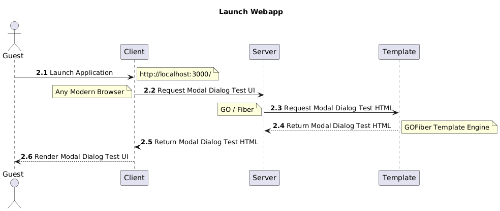

# Abstract

This repository introduces two different methods to display `HTML / HTMX` modal dialogs utilizing the native [HTML](https://developer.mozilla.org/en-US/docs/Web/HTML/Reference/Elements/dialog) `<dialog>` element.

A `modal dialog box` is a pop-up window that appears on top of the current browser page, requiring user interaction before the user can return to the main content. It is commonly used for user notifications, forms, or custom content. We use `browser modal dialogs` to prompt the user to confirm an action, such as deleting a record, and `server modal dialogs` to either `inform the user about the result of an operation`, like lack of authorization for access a resource-- or to `collected addition data`, like a phone number.

We will demonstrate our approach using a simple web applications with a technology stack consisting of  [Go](https://go.dev/), [Fiber](https://gofiber.io/), the [Fiber Template Engine](https://docs.gofiber.io/template/html_v2.x.x/html/) and [Bootstrap 5](https://getbootstrap.com/) on the server, and [HTMX](https://htmx.org/) and [HyperScript](https://hyperscript.org/) to manipulate the DOM Tree, enabling a very limited use of Javascript. 

This technology stack requires the Server to serve HTML, whereas other stacks use JSON requiring more complex technology stack on the Client. Deceivingly, both examples

The first method demonstrates how to show a modal dialog triggered `browser logic`.  The second method demonstrates how to show a modal dialog triggered by `server logic`.

Note that:
- When refering to the `Server`, I'm referring to the `Go/Fiber` HTTP server;
- When refering to the `Template`, I'm referring to the `GoFiber Template` engine;
- When refering to the `Client`, I'm referring to any **modern** browser;

# A Word About our Demo Webapp
Web applications using complex Client technology stacks, such as [React](https://react.dev/) and its vast constellation of addons, can handle the logic to triger, display, and manage `Browser Modal Dialog` boxes without any Server interaction. Their Clients' technology stacks interact with their Servers to handle `Server Modal Dialog` boxes.

Our webapp demo uses a significantly simpler Client technology stack, [HTMX](https://htmx.org/) and [HyperScript](https://hyperscript.org/) to manipulate the DOM Tree, with a limited use of Javascript. It requires the Client to request the Server to provide the `Browser Modal Dialog` box Template, but then it handles all interections with the `Browser Modal Dialog` box; like the former, its Client' technology stack interacts with its Servers to handle `Server Modal Dialog` boxes. 

In other words, whereas the former technology stack requires server interactions only for `Server Modal Dialogs`, our webapp requires two distinct types of Server interactions; one to simply serve the `Browser Modal Dialog` Template and the other to realize the requirement for a `Server Modal Dialog`, serve its Template, collect and process the Person's interaction.

Our webapp will use the same Template for its `Browser Modal Dialog` and `Server Modal Dialogs`boxes, passing arguments to the Template Engine to render them accordingly.  

# Broswer Triggered Modal Dialogs
I'll discuss the use cases, the architecture required to support them, and the implementation to support them.

## Use Cases
- **Setup Client/Server**: I, as a guest, want to launch the HTTP server, `Go_Fiber`, and the HTTP client, any `Browser` will do, I will use to experience the `browser and server triggered modal dialogs`;
- **Launch Appplication**: I, as a guest, want to type the Server listening address in the Client address Bar to launch the demo application and see a `Landing Page` consisting of a UI element named `Modal Dialog Tests`, inclulding a button, `Browser`;
- **Show Browser Modal**: I, as a guest, when at the `Modal Dialog Tests` landing page, want to clik on the `Browser` button and observe a responsde consting of a modal dialog including `Exit`, a `Decline`, and an `Accept` buttons;
- **Dismiss Browser Modal**:  I, as a guest, when at the Dialog Tests screen, want to clik the `Exit` button and dismiss the dialong without any additional system behavior;
- I, as a guest, when at the Dialog Tests screen, want to clik the `Decline` button, receive a reply from the server indicating that I clicked the Decline button, and dismiss the dialong without any additional system behavior;
- I, as a guest, when at the Dialog Tests screen, want to clik the `Accept` button, receive a reply from the server indicating I clicked the Accept button, and dismiss the dialong without any additional system behavior;

## Architecture
The best way me to describe it is thru a few architecture diagrams depicting the main technology elements supporting the use case

### Setup Client/Server
This amounts to building and launching he Go/Fiber HTTP Server, which I'll describe below, as well as launching the HTTP client--any browser will do;

### Launching the Application


<sub>Launch Sequence Diagram</sub>

- The Guest types the application URL in their Client's address bar;
- The Client issues a "/" route request;
- The Server collaborates with the Template to render the landing page, and to return it back to the client, via the Server;


<sub>Landing Page</sub>


### Show Browser Modal
Now the Guest is ready to experiment with the browser triggered modal dialog:

<sub>Show Browser Modal Sequence Diagram</sub>

- The Guest clicks on the Landing Page's `Browser` button; this button includes two configuration elements to route the request and to assist HTMX to find where and then render the Browser Modal dialog:
  - **hx-get**="/browserModal": it routes the request
  - **hx-target**="#htmx-browser-dialog-container">: it points to HTMX where to render the resulting Modal Dialog
- The Client, with HTMX assistance, issues an "/browserModal" HTTP request to the Server;
- The Server fills up a map with the arguments required for Modal Dialog--note that I'm referring to a generic instead of specific Modal Dialog; this means that I'll use the same dialog for the Browser and Server triggered Modal Dialogs;
- The Server collaborates with the Template to render the Browser Modal Dialog, and to return it back to the Client, via the Server;


<sub>Browser Modal Dialog</sub>

In addition to the Header and Body information, notice the `Exit`, being represented by an `x`, `Decline` and `Confirm` buttons.

Also, if I attempt to click on the `Browser` and `Server` buttons in the `Landing Page`, ini this case hidden, I will observe they have been disabled, and will continue to be so until I dismiss the `Browser Modal Dialog`.

## Implementatioon
I'll use a simple [Go](https://go.dev/), [Fiber](https://gofiber.io/) app, initialized as follows:

``` go
package main

import (
    "github.com/gofiber/fiber/v2"
    "github.com/gofiber/template/html/v2"
)

func main() {
	// Set up the HTML template engine
	engine := html.New("./views", ".html")

	// Create a new Fiber app with the template engine
	app := fiber.New(fiber.Config{
		Views: engine,
	})

    // ...

	app.Listen(":3000")
}
 
```