# Abstract and Acknowledgement
I built a mobile-first SaaS enterprise resource planning application. The mobile-first requirement imposed two constraints. One, I’m not inclined to build at least two native applications, or spend money with frameworks that support it. Second, a webapp running on a phone must be stingy with resource utilization to prevent performance degradation.

This lead me to architect a solution with a minimal Browser footprint, using [Go](https://go.dev/) as the server engine and [Fiber](https://gofiber.io/) as the HTTP server. This led me to leveraging [Go HTML Templates](https://pkg.go.dev/html/template) with the [Fiber Template Engine](https://docs.gofiber.io/template/html_v2.x.x/html/) to collaborate with [HTMX](https://htmx.org/) and [HyperScript](https://hyperscript.org/) to manipulate the DOM Tree on the Client.

Early in my work, someone challenged me to implement ‘Modal Dialogs’ issued by the server, such as those that would inform a guest they did not have authorization to access a resource. The excellent article [Two ways to build HTML dialogs using HTMX and HyperScript](https://medium.com/@martin.mohnhaupt/two-ways-to-build-html-dialogs-using-htmx-and-hyperscript-5f5eefb13c4c) by [Martin Mohnhaupt](https://medium.com/@martin.mohnhaupt) has been instrumental to aid me in thinking about and implementing `Modal Dialogs` in my webapp. 

This repository introduces two different methods to display `Modal Dialogs`, `Browser Modal Dialog` and `Server Modal Dialog`. A _Modal Dialog_ is a pop-up window that appears on top of the current browser page, requiring user interaction before the user can return to the main content. It is commonly used to request confirmation to proceed with a destructive operation, notify the user of a relevant application state, or collect required information from the user. We use _Browser Modal Dialogs_ to prompt the user to confirm an action, such as deleting a record, and _Server Modal Dialogs_ to either inform the user about the result of an operation, like lack of authorization for access a resource-- or to collect additional data, like a phone number.

I will use Martin’s approach, refactored to suit my requirements, using a simple web application with a technology stack consisting of  [Go](https://go.dev/), [Fiber](https://gofiber.io/),  and the [Fiber Template Engine](https://docs.gofiber.io/template/html_v2.x.x/html/) on the Server, and [Bootstrap 5](https://getbootstrap.com/) , [HTMX](https://htmx.org/) and [HyperScript](https://hyperscript.org/) to manipulate the DOM Tree on the Client. This technology stack requires the Server to serve HTML, whereas other stacks use JSON requiring more complex technology stack on the Client; it also provides the software engineer with strategies to define precise places in the `DOM Tree`, as well as to decorate some of the DOM Tree elements with event handling instructions. 

Note that:

- I’ll use the term `Server`, to refer to the `Go/Fiber` HTTP server;

- I’ll use the term `Template`,to refer to the `GoFiber Template` engine;

- I’ll use the term `Client`, to refer to the [HTMX](https://htmx.org/) and [HyperScript](https://hyperscript.org/) logic to handle the Templates returned by the _Server_ and hosted by any **modern** browser;

- I’ll use the term `webapp`, to refer to the web application comprising the _Client_ and _Server_ mentioned above;

You can find the full implementation at [this repo](https://github.com/RodrigoMattosoSilveira/html_htmx-modal_dialogs) on [my GitHub account](https://github.com/RodrigoMattosoSilveira).

# A Word About the Webapp Demo
Web applications using complex Client technology stacks, such as [React](https://react.dev/) and its vast constellation of addons, can handle the logic to trigger, display, and manage _Modal Dialogs_  with minimal Server interaction. 

This _webapp_ uses a significantly simpler Client technology stack, [HTMX](https://htmx.org/) and [HyperScript](https://hyperscript.org/) to manipulate the DOM Tree, with a limited use of Javascript. Instead of relying on JSON payload and complex logic to express the User Experience, it relys on fully rendered HTML. 

The _Landing Page_ includes 3 buttons:  `Prompt`, `Inform`, and `Collect`. All three  share similar logic where the _Client_ requests _HTML_ from the Server, which independent of the _Modal Dialogs’_ own logic. 

The _Prompt_ button starts a _Modal Dialog_ which requires the guest to either okay or cancel an operation. When the guest triggers the _Inform_ button, a _Modal Dialog_ informs them about the server state, and they need to do nothing else. The _Collect_ button triggers a _Modal Dialog_ asking the guest to provide a data element, or dismiss the dialog; this is a more complex _Server_ _Modal Dialog_.

# Implementation
I'll describe the webapp implementation as follows, including sequence diagrams:
- Launch webapp
- Prompt Modal Dialog
- Inform Modal Dialog
- Collect Modal Dialog

For each of the four topics above I'll describe:
- The Use Cases, using use case diagrams; a use case is a detailed description of how a user interacts with a system to achieve a specific goal. Although ours are relatively simple, I included them here since I wrote and used them to implement the webapp, and thought they would help me explain the webapp. Following are the use cases for our webapp, including the logic I used to implement them:
- The Server Implementation
- The Client Implementation

## Launch Webapp
This is the logic to support launching the webapp and arriving at the _Landing Page_
### Launch Webapp Use Cases

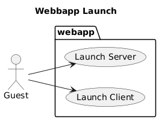

<sub>Launch Webapp</sub>

1. **Launch Server**: I, as a guest, when I launch the _Server_, I want to see the _Fiber_ log indicating that its ready to handle _HTTP_ requests;
1. **Launch Client**: I, as a guest, when I launch the _Client_, after typing the server access URL, want to see the _Landing Page_ consisting of a UI element named `Modal Dialog Tests`, including two buttons, `Prompt`, `Inform`, and `Collect`;


### Launch Webapp Server
``` go
package main

import (
	"log"

	"github.com/gofiber/fiber/v2"
	"github.com/gofiber/template/html/v2"
)

func main() {
	// Set up the HTML template engine
	engine := html.New("./views", ".html")

	// Create a new Fiber app with the template engine
	app := fiber.New(fiber.Config{
		Views: engine,
	})

	// Route to render the Landing Page
	app.Get("/", func(c *fiber.Ctx) error {
		log.Println("Route to render the Landing Page")
		return c.Render("index", nil)
	})

	// Route Management logic omitted ... 

	// Start the server
	app.Listen(":3000")
}
```
Notes:
- The command `engine := html.New("./views", ".html")` configures the `GO HTML Template` engine to look for its `HTML fragments` in the `./views` folder and using the `.html` extention;
- The command `	app := fiber.New(fiber.Confi{Views: engine,})` configures `Fiber` as the webapp's HTTP server using its Template engine;
- The following command:
  - Sets up the `Landing Page` route to `/`;
  - Logs the event;
  - Renders the `Landing Page` using the `./views/index.html` HTML fragment;
  - Returns the `Landing Page` to the Client;
``` go
	app.Get("/", func(c *fiber.Ctx) error {
		log.Println("Route to render the Landing Page")
		return c.Render("index", nil)
	})
```
- The command `	app.Listen(":3000")` configures the HTTP Server, Fiber, to listen on port 3000;
  
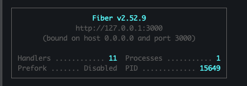

<sub>Launch Server</sub>

### Launch Webapp Client
I'll focus on the markup required to render the Landing Page, ommiting everything else, given our focus on the Modal Dialogs and the logic to publish, use, and handle them:
``` html
<!DOCTYPE html>
<html lang="en">
<head>
   <!-- Ommited CSS, see github for details-->
</head>
<body>
    <!-- Browser initiated dialog placeholder -->
    <div id="htmx-browser-dialog-container"></div>

    <!-- Server initiated dialog placeholder -->
    <div id="htmx-server-dialog-container" _="on dialog_event from body put detail.value into me"></div>
    
	<!--div class="d-flex aligns-items-center justify-content-center card text-center w-75 mx-auto"></div-->
	<div class="card d-flex aligns-items-center justify-content-centertext-center w-75 position-absolute top-50 start-50 translate-middle">
    	<div class="card-header">
   			<h1>Modal Dialog tests</h1>
		</div>
		<div class="card-body">
			<button type="button" class="btn btn-danger" hx-get="/promptModal" hx-target="#htmx-browser-dialog-container">Prompt</button>
			<button type="button" class="btn btn-warning" hx-get="/informModal" hx-target="#htmx-browser-dialog-container">Inform</button>
			<button type="button" class="btn btn-success" hx-get="/collectModal" hx-target="#htmx-server-dialog-container">Collect</button>
		</div>
	</div>
	<!--  Omitted scrips, see github for details -->
  </body>
</html>
```
Notes:
- The architecture requires that I use two different landing regions for the _Modal Dialogs_, depending on their nature (it took me a long time to find an example that made a working distinction). I use ` <div id="htmx-browser-dialog-container">` to host _Browser Modal Dialogs_ and ` <div id="htmx-server-dialog-container">` to host _Server Modal Dialogs_; the the discussion below for the strategy to place them at these elements;
- I used a [Bootstrap Card](https://getbootstrap.com/docs/5.3/components/card/) to help build this responsive user experience expeditiously;
- The heart of the User Experience logic reside in the element `<div class="card-body">`, consisting of three buttons:
  - ` hx-get="/promptModal"` - Triggers the _Server_ to render a _Browser Modal Dialog_, prompting the guest to either proceed or abandon a dangerous operation;
  - ` hx-get="/informModal"` - Triggers the _Server_ to render a _Server Modal Dialog_, informing the guest about a system state, like an attempt on the guest's part to access an unauthorized resource;
  -   - ` hx-get="/collectModal"` - Triggers the _Server_ to render a _Server Modal Dialog_, prompting the guest to provide data;
  -   

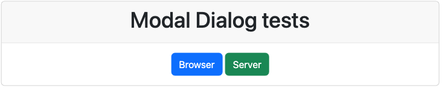

<sub>Landing Page</sub>

## Prompt Modal Dialog
### Prompt Modal Dialog Use Cases
1. **Show Prompt Modal Dialog**: I, as a guest, when at the _Landing Page_, want to clik on the _Prompt_ button and observe a _Modal Dialog_ response, consisting of: i. a _Header_ informing me of an _Action Required_, e.g., _Action Required_, ii. a body with details about the required action, e.g, _Please confirm your choice to DELETE this record, or click x to dismiss_, and iii. a _Footer_ with a _Primary / Danger_ button with the text _Confirm_;
1. **Prompt Modal Dialog Dismiss**: I, as a guest, after triggering the _Prompt Modal Dialog_, want dismiss the dialog without confirrming the prompt;
1. **Prompt Modal Dialog Exit**: I, as a guest, after triggering the _Prompt Modal Dialog_, want exit the dialog without confirrming the prompt;
1. **Prompt Modal Dialog Confirm**: I, as a guest, after triggering the _Prompt Modal Dialog_, want to Confirm the prompt;
1. **Prompt Modal Dialog Follow Up**: I, as a guest, after confirming or dismissing a _Prompt_ _Modal Dialog_, want to see _Server_ and _Client_ logs reflecting my choice;

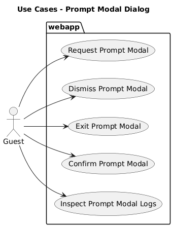

<sub>Prompt Modal Dialog Use Cases</sub>

### Prompt Modal Dialog Server
I show only a fragment of the `main.go` file, where it resides, for simplicity sake
``` go

	// Route to handle the Client request for the server to execute the logic
	// that supports a browser triggered Modal Dialog, prompting the Guest to 
	// confirm an action
	app.Get("/promptModal", func(c *fiber.Ctx) error {
		// return c.SendString("Generate Browser Modal!")
 		log.Println("Prompt Modal Dialog: Route to prompt the Guest to confirm an action")
        return c.Render("modalDialog", fiber.Map {
            "title": "Action Required",
            "body": "Please confirm you want to delete this record, or exit the dialog.",
            "action_route": "promptModalConfirm",
            "action_label": "Confirm",  
			"action_class": "btn  btn-danger",  

            })
    })

	// Route to render the Guest Confirming the prompt by clicking the Confirm button
	app.Get("/promptModalConfirm", func(c *fiber.Ctx) error {
		message := "Prompt Modal Dialog: Route to handle the Guest confirming prompt by clicking the Confirm button on the Modal Dialog"
		log.Println(message)
		return c.Status(fiber.StatusOK).SendString(message)
	})
```
Notes, the commands:
- `app.Get("/promptModal", func(c *fiber.Ctx) error { ... }` configures _Fiber_ to execute the the `func(c *fiber.Ctx) error { ... }`  whenever the _Client_ submits a request to `/promptModal`;
- `log.Println("Prompt Modal Dialog: Route to prompt the Guest to confirm an action")` records the event in the server console;
- `return c.Render("modalDialog", fiber.Map { ... }` asks Fiber to use the provided _fiber.map_ to render the _Prompt Modal Dialog_, and return the HTML to the Client; 

Observe that:
- the _fiber.map_ is slightly different for each dialog, leaving it to the [Go HTML Templates](https://pkg.go.dev/html/template) to use it render the  _Modal Dialog_ based on its content;
- the Client's [HTMX](https://htmx.org/) will place rendered _HTML_ on the location configured by the button that triggered this event, `hx-target="#htmx-browser-dialog-container">`
- See the notes and observations on the _Modal Dialog_ for the logic to close and remove the _Modal Dialog_ from the _DOM Tree_;

### Prompt Modal Dialog Client
``` html
<dialog class="dialog   w-75" _="on load call htmx.process(me) then call me.showModal() end
                          on dialog_close wait 10ms then remove me end
                          on keydown if the event's key is 'Escape' then log `Clicked ESC key` remove me">
	<form>
	<div class="card ">
		<div class="card-header">
			<div class="row">
				<div class="col-md-10">
					<h5 class="modal-title">{{ .title }}</h5>
				</div>
				<div class="col-md-2">
					<button type="button" class="close" _="on click send dialog_close log 'Clicked Exit Button'"><span aria-hidden="true">&times;</span></button>
				</div>
			</div>
		</div>
		<div class="card-body">
			<p class="card-text">{{ .body }}.</p>
			{{if eq .action_label "Submit"}}
					<div class="col-auto">
						<label for="collectAge" class="col-form-label">Age</label>
					</div>
					<div class="col-auto">
						<input type="number" id="collectAge" name="age" class="form-control">
					</div>
					<!-- <button type="submit" class="btn btn-primary"  hx-postt="/{{ .collect_endpoint }}">Submit</button> -->
			{{end}}
			<div class ="card-footer">
				{{if eq .action_label "Confirm"}}
					<button type="button" class="{{ .action_class}}" hx-get="/{{ .action_route }}"  hx-swap="none" _="on click send dialog_close log 'Clicked Primary Button'">{{ .action_label }}</button>
				{{end}}

				{{if eq .action_label "Submit"}}
					<button type="submit" class="{{ .action_class}}" hx-post="/{{ .action_route }}"  hx-swap="none" _="on click send dialog_close log 'Clicked Primary Button'">{{ .action_label }}</button>
				{{end}}		
			</div>
		</div>
	</div>
	</form>
</dialog>
```
Notes:
- I used the [Bootstrap Card](https://getbootstrap.com/docs/5.3/components/card/), embedded in an [HTML Form](https://www.w3schools.com/tags/tag_form.asp); this enables me to place the buttons anywhere in the _Card_, ensuring that, if their type is `submit`, the Client will send their form inputs to the server;
- All _Modal Dialogs_ have an Exit button, `x`, configured to issue a `dialog_close` event, which is captured by the [HyperScript](https://hyperscript.org/) logic in the `<dialog/>` element at the top, closing the _Modal Dialog_ and removing it from the _DOM Tree_;
- the constructs of the type `{{ .<<name>>}}` assign values passed on the `c.Render` call thru the `fiber.map {...}`
- the constructs of the type `{{if  ...}}` use `fiber.map {...}` parameters to fine tune the _Modal Dialog_; in this case, it add a `<button type="button" class="{{ .action_class}} ...` button, configured to use the `btn  btn-danger` class;

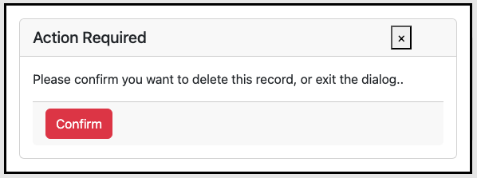

<sub>Prompt Modal Dialog</sub>

Notes:
- The guest can dismiss the prompt modal dialog by clicking the `esc` keyboard key, or exit it by clicking the exit button at the top right, `x`;
- The guest can confirm the operation by clicking the confirm button; in this case, the Client dismisses the _Modal Dialog_, issues an HTTP Request, `/promptModalConfirm` which will, cause the server to log it to is console, and return an OK result.

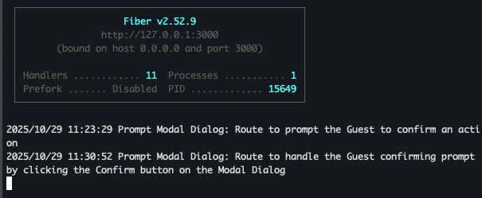

<sub>Prompt Modal Server Log</sub>

- I can see the chat between Client and Server by opening up the Client Development Tools and inspecting network traffic:

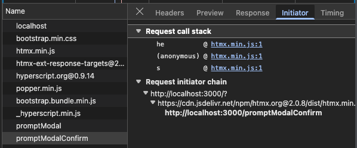

<sub>Prompt Modal Client Log</sub>


## Inform Modal Dialog
### Inform Modal Dialog Use Cases
1. **Show Inform Modal Dialog**: I, as a guest, when at the _Landing Page_, want to clik on the _Inform_ button and observe a _Modal Dialog_ response, consisting of: i. a _Header_ informing me of an _Information_, e.g., _Information_, ii. a body with details about the required action, e.g, _You are not authorized to access this resource, please click `x` to _dismiss_, and iii. No buttons on the _Footer_;
1. **Inform Modal Dialog Dismiss**: I, as a guest, after triggering the _Inform Modal Dialog_, want dismiss the dialog without any additional webapp behavior;
1. **Inform Modal Dialog Exit**: I, as a guest, after triggering the _Inform Modal Dialog_, want exit the dialog without any additional webapp behavior;
1. **Inform Modal Dialog Follow Up**: I, as a guest, after dismissing an _Information_ _Modal Dialog_, want to see _Server_ and _Client_ logs reflecting my choice;

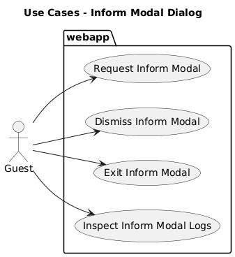

### Inform Modal Dialog Server
I show only a fragment of the `main.go` file, where it resides, for simplicity sake

``` go
	app.Get("/informModal", func(c *fiber.Ctx) error {
		// return c.SendString("Generate Server Modal!")
		log.Println("Modal Dialog: Route to handle the server informing the Guest about a server state")
        data := fiber.Map {
            "title": "Authorization Error",
            "body": "You are not authorized to perform this action.",
            "action_route": "", //
            "action_label": "",       
 			"action_class": "",  
           }

        // Trigger a dialog_event in the server!
        c.Set("HX-Trigger", "dialog_event")
        return c.Render("modalDialog", data)
	})
```
Notes:
- It has the same structure as the _Prompt_ _Modal Dialog_, except that it does not include a route to handle the guest's response, since it is in informational dialog.
- Also, not how the `action-*` parameters are all blank; this enables the _Template_ parser to use it to avoid including unnecessary HTML elements;

### Inform Modal Dialog Client
It uses the same _HTML_ fragment as the other two, except that the data in the `fiber.Map { ...}` and the _HTML Template_ will render a slight different HTML; in this case it has the header and body, but is does not have an guest action buttons;

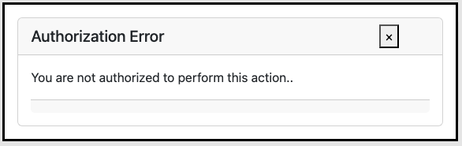

<sub>Inform Modal Client DiaLog</sub>

## Collect Modal Dialog
### Collect Modal Dialog Use Cases
1. **Show Collect Modal Dialog**: I, as a guest, when at the _Landing Page_, want to click on the _Collect_ button and observe a _Modal Dialog_ response, consisting of: i. a _Header_ informing me of an _Data Collection_, e.g., _Please Provide Following Data_, ii. a body with a form including one input for the guest's age, and iii.  a _Footer_ with a _Primary_ button with the text _Submit_;
1. **Collect Modal Dialog Dismiss**: I, as a guest, after triggering the _Collect Modal Dialog_, want dismiss the dialog without any additional webapp behavior;
1. **InfCollectorm Modal Dialog Exit**: I, as a guest, after triggering the _Collect Modal Dialog_, want exit the dialog without any additional webapp behavior;
**Collect Modal Dialog Input**: I, as a guest, after triggering the _Collect Modal Dialog_, want to input my age;
1. **Collect Modal Dialog Follow Up**: I, as a guest, after submitting or dismissing an _Collect_ _Modal Dialog_, want to see _Server_ and _Client_ logs reflecting my choice;

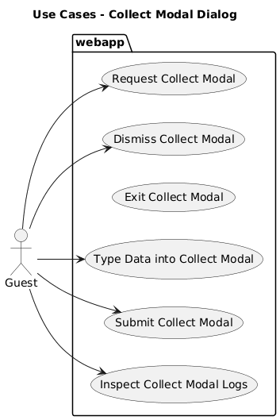

<sub>Collect Modal Dialog Use Cases</sub>

### Collect Modal Dialog Server
I show only a fragment of the `main.go` file, where it resides, for simplicity sake

``` go
	app.Get("/collectModal", func(c *fiber.Ctx) error {
		// return c.SendString("Generate Server Modal!")
		log.Println("Modal Dialog: Route to handle the server requesting the Guest to provide data")
        data := fiber.Map {
            "title": "Guest Data Collection",
            "body": "Please Provide the data below",
            "action_route": "collectModalSubmit",
            "action_label": "Submit",      
 			"action_class": "btn btn-primary",  
           }

        // Trigger a dialog_event in the server!
        c.Set("HX-Trigger", "dialog_event")
        return c.Render("modalDialog", data)
	})

	// Route to render the Client Browser Modal Decline
	app.Post("/collectModalSubmit", func(c *fiber.Ctx) error {
		age := c.FormValue("age")
		message := "Collect: Route to handle age provided by guest: " + age
		log.Println(message)
		return c.Status(fiber.StatusOK).SendString(message)
	})

```
- Notes:
  - The `app.Get("/collectModal", func(c *fiber.Ctx) error {` setup logic is similar to the other two _Modal Dialogs_;
  - The `c.Render("modalDialog", data)` is preceded by the ` c.Set("HX-Trigger", "dialog_event")` command, which is the key to trigger a _Server Modal Dialog_ in this architecture; as the _Client_ starts to process this _HTTP Response_; see the client for more details:

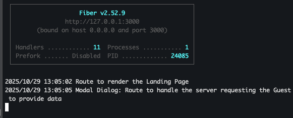

<sub>Collect Modal Server Log</sub>

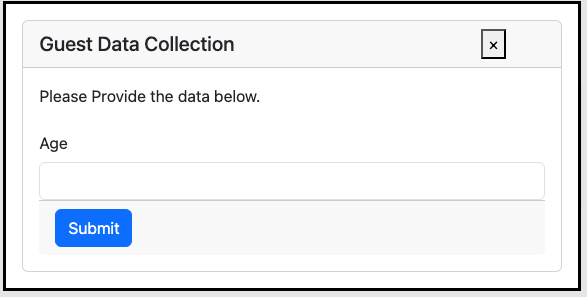

<sub>Collect Modal Dialog</sub>

### Collect Modal Dialog Client
I'll repeat the _Modal Dialog_ here due the number of changes to support data collection:
``` html
<!-- Added Bootstrap Classes; still not clean -->
<dialog class="dialog   w-75" _="on load call htmx.process(me) then call me.showModal() end
                          on dialog_close wait 10ms then remove me end
                          on keydown if the event's key is 'Escape' then log `Clicked ESC key` remove me">
	<form>
	<div class="card ">
		<div class="card-header">
			<div class="row">
				<div class="col-md-10">
					<h5 class="modal-title">{{ .title }}</h5>
				</div>
				<div class="col-md-2">
					<button type="button" class="close" _="on click send dialog_close log 'Clicked Exit Button'"><span aria-hidden="true">&times;</span></button>
				</div>
			</div>
		</div>
		<div class="card-body">
			<p class="card-text">{{ .body }}.</p>
			{{if eq .action_label "Submit"}}
					<div class="col-auto">
						<label for="collectAge" class="col-form-label">Age</label>
					</div>
					<div class="col-auto">
						<input type="number" id="collectAge" name="age" class="form-control">
					</div>
					<!-- <button type="submit" class="btn btn-primary"  hx-postt="/{{ .collect_endpoint }}">Submit</button> -->
			{{end}}
			<div class ="card-footer">
				{{if eq .action_label "Confirm"}}
					<button type="button" class="{{ .action_class}}" hx-get="/{{ .action_route }}"  hx-swap="none" _="on click send dialog_close log 'Clicked Primary Button'">{{ .action_label }}</button>
				{{end}}

				{{if eq .action_label "Submit"}}
					<button type="submit" class="{{ .action_class}}" hx-post="/{{ .action_route }}"  hx-swap="none" _="on click send dialog_close log 'Clicked Primary Button'">{{ .action_label }}</button>
				{{end}}		
			</div>
		</div>
	</div>
	</form>
</dialog>
```
- Notes:
 - When handling the _HTTP Response_
    - _HTMX_ recognizes the `HX-Trigger` parameter and issues the `dialog_event` event;
    - _Hyperscript_, configured to recognize this event on _Landing Page_ `<div id="htmx-server-dialog-container" _="on dialog_event from body put detail.value into me"></div>` statement, grabs the HTML response and inserts on the DOM Tree, underneath `<div id="htmx-server-dialog-container"`
  - The logic controlled by the `action_label`, `Submit` in this case, directs _HTML Template_ to include the HTML fragment used to capture the guest's age;
  - The `button` is of a `submit / primary` type; the submit is required to instruct. the _Broswer_ to include the named form input elements in the _HTTP Request_;
  - Once the guest types their age and clicks on the submit button, the _Browser_ issues an _HTTP Post **Request**_ to the _Server_, which is handled by the `app.Post("/collectModalSubmit", func(c *fiber.Ctx) error { ... }`; observer that:
    - The HTTP Post Handler extracts the age and, logs a messsage including the returned age, and sends the same message to the _Client_


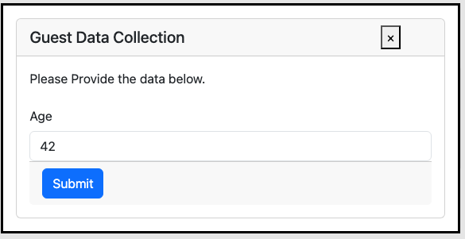

<sub>Collect Modal Dialog, with the guest reply</sub>


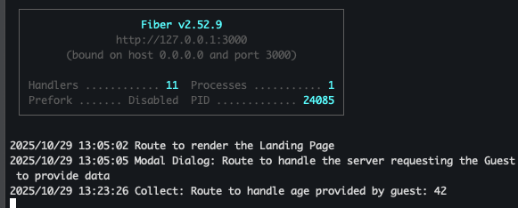

<sub>Collect Modal Dialog Server Log</sub>

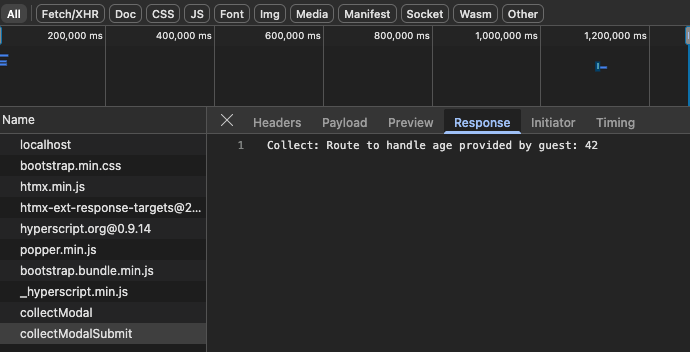

<sub>Collect Modal Dialog Client Log</sub>

# Conclusion
My goal was to learn how to implement server triggered modal dialogs using the technology stack I selected to build my mobile first SaaS ERP. 

I found an excellent example in the article [Two ways to build HTML dialogs using HTMX and HyperScript](https://medium.com/@martin.mohnhaupt/two-ways-to-build-html-dialogs-using-htmx-and-hyperscript-5f5eefb13c4c) by Martin Mohnhaupt, add adapted it my technology stack.

Martin provides two examples, one on how to trigger a _Server Modal Dialog_ and another  on how to trigger a Browser Modal Dialog_. In this article I expanded Martin's work to have two distinct _Server Modal Dialogs_, one providing server state information to the guest, and the other collecting data from the guest.